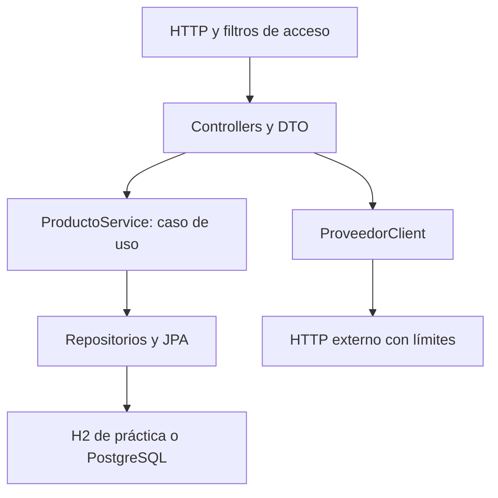

# Arquitectura y decisiones

## Persistencia y relaciones

Categoria 1 a 0..N Producto. Un producto exige categoría; la FK impide referencias ausentes y protege una categoría con hijos. Producto→Categoria no propaga REMOVE porque es compartida. EntityGraph trae categoría en consultas de DTO; open-in-view=false exige mapear dentro de transacción. El índice categoria_id puede ayudar búsquedas por categoría; no se afirma que acelere la búsqueda por texto con comodines.

## Carrera y versión

SKU UNIQUE resuelve la carrera entre existsBySku e INSERT. La comprobación temprana mejora el mensaje, no sustituye la restricción. Actualización exige versión del cliente y JPA @Version protege una modificación entre lectura y flush. Una carrera puede producir conflicto aunque ambas entradas fueran válidas. DELETE no tiene un precondicional de versión en este alcance: no prometas impedir un borrado concurrente basado en una pantalla antigua. Un sistema que lo requiera debe añadir versión/If-Match y pruebas.

## Transacciones

Crear, actualizar y eliminar son unidades de servicio; el proxy administra commit/rollback. saveAndFlush/flush envían SQL, no confirman la operación. Las llamadas internas entre métodos del mismo objeto no cruzan ese proxy. Consultas readOnly son una indicación, no permiso de base de datos. CategoriaController es un CRUD sencillo directo al repositorio, un compromiso explícito de este ejemplo pequeño.

## Seguridad y operación

La cadena de filtros actúa antes de MVC. CSRF sigue activo; errores 401/403 tienen handlers propios. Contraseñas externas se codifican con PasswordEncoder para estas identidades de memoria. No se almacenan usuarios en DB ni se implementa login web. La política evita exponer Actuator completo y el filtro request id no registra cuerpo ni credenciales.

## Qué prueban las capas

| Prueba | Riesgo | Límite |
|---|---|---|
| servicio/dominio | invariantes y decisiones | no prueba SQL/HTTP |
| WebMvcTest | contrato y filtros | servicio simulado |
| DataJpaTest | relación, consulta, FK/UNIQUE | H2 no equivale a PostgreSQL |
| SpringBootTest + MockMvc | capas reales, migraciones H2 | sin socket HTTP real |
| verificador del JAR | TCP, Basic/CSRF, DB y artefacto | escenarios definidos, no todos los dominios |
| CI Docker Linux | imagen ejecutada con DB real | no implica todos los hosts/arquitecturas |

[Contrato](CONTRATO_API.md) · [Verificación](VERIFICACION.md)
